
<h1 align="center">网上医院预约挂号系统</h1>

## 简介
网上医院预约挂号系统：用户可进行预约挂号、医生信息管理、用户病例管理、支付操作、健康资讯查看等功能，界面简洁，操作便捷，有效提升医疗服务效率。    --计算机毕业设计源码；毕设源码；java毕业设计源码

## 联系方式

<h3 align="center">获取完整代码与数据库文件 + 微信：deepguan QQ: 86050149 QQ群: 783742310</h3>

<h3 align="center">可帮忙远程部署 包运行成功！提供远程部署、修改代码、设计文档指导、代码讲解等服务！</h3>

## 功能介绍（完整见运行截图）
管理员：基本功能包括用户管理、科室管理、医生管理和预约挂号管理，可以进行用户信息的增删改查、科室和医生信息维护、坐诊时间设定和挂号信息管理。系统管理支持密码修改、通知管理和审核功能。管理员通过导航菜单进行快速访问和操作，提高系统运行效率。

医生：医生可以管理和查看自己的坐诊信息，包括个人简介、职称、工号、挂号价格、坐诊时间、科室和擅长领域。医生还可以管理和上传患者的病例、上传病历附件以及填写药单和注意事项，确保患者信息的完整和准确。

用户：用户可以进行注册和登录，访问个人中心管理个人信息。用户可选择医生并预约挂号，填写基本信息如姓名、手机号和病情，查看医生信息和预约记录。系统也提供健康资讯和新闻资讯模块，让用户获取最新的健康相关信息。

患者：患者可以通过系统输入并管理个人信息、查看医生坐诊安排并进行预约。患者可上传病历附件，选择适合的支付方式进行在线支付。系统内的病例管理功能允许患者随时查看和下载自己的病例详细信息，提高医疗服务的便捷性。

## 运行截图
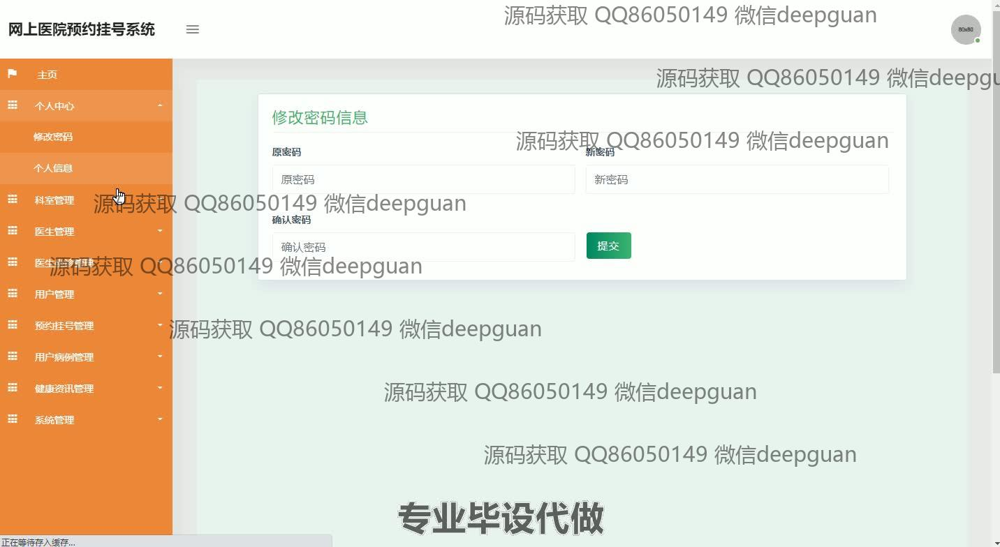

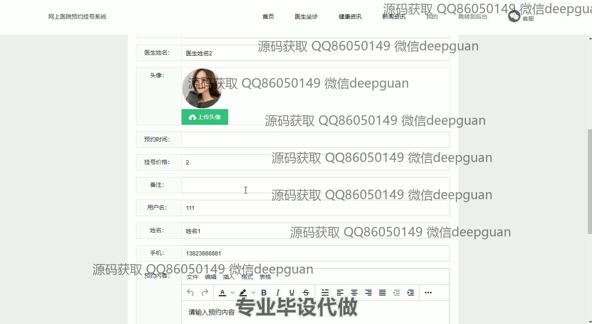
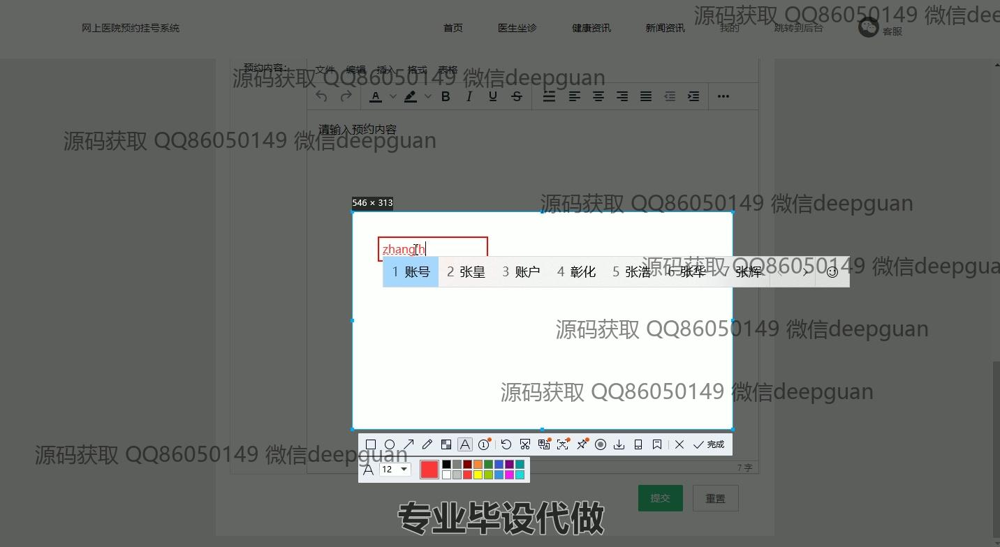
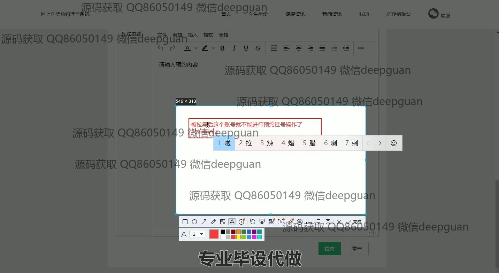

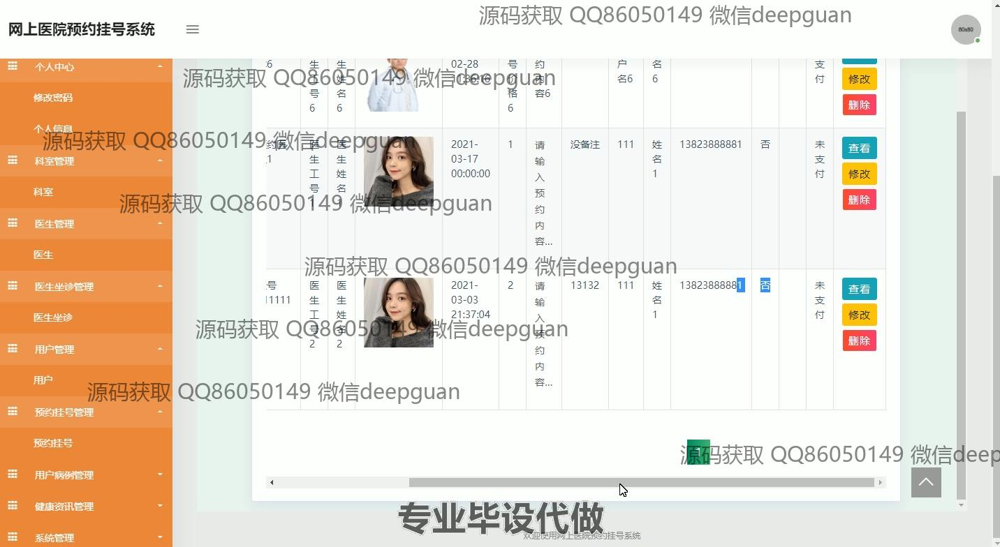
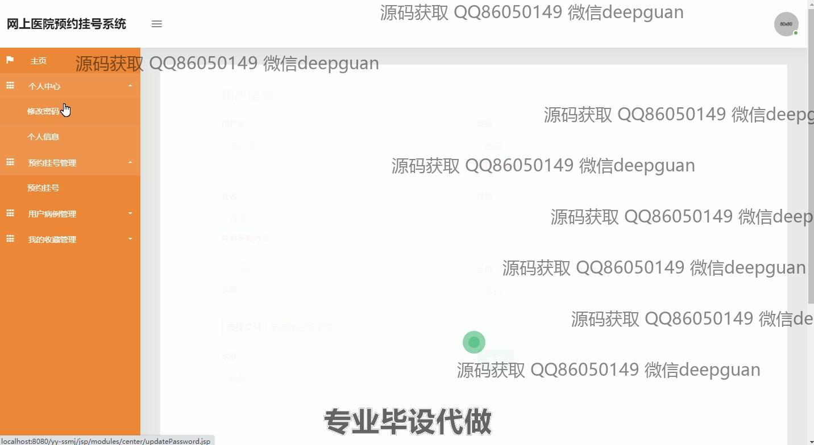
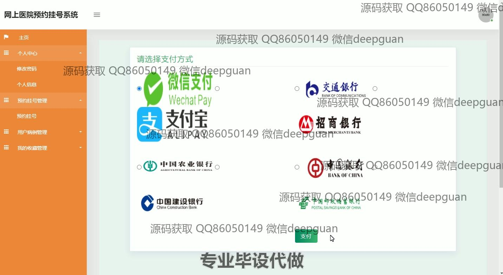

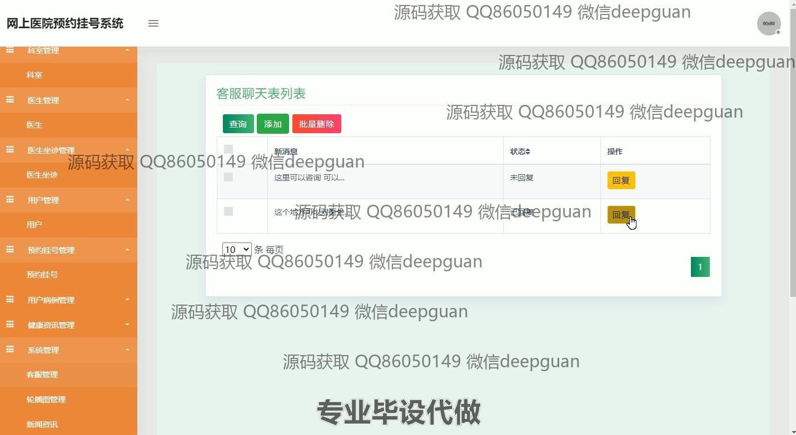

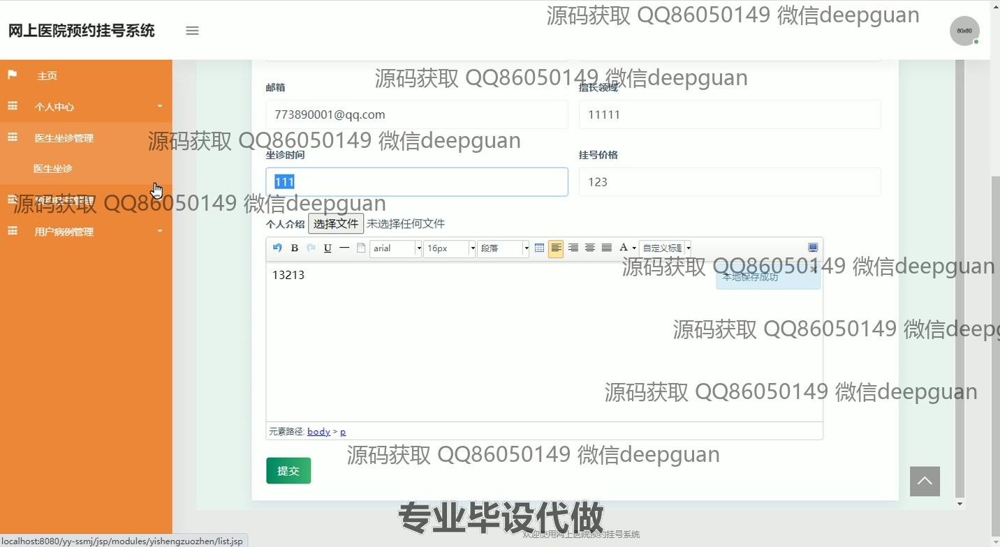
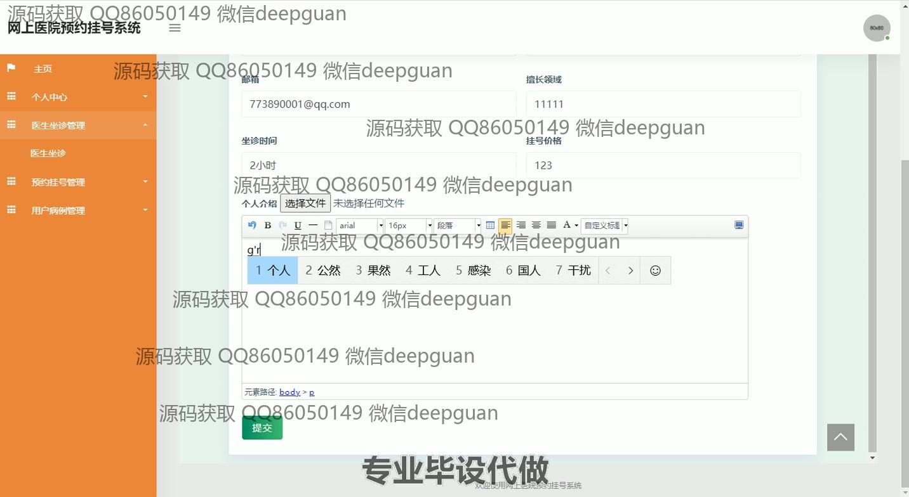
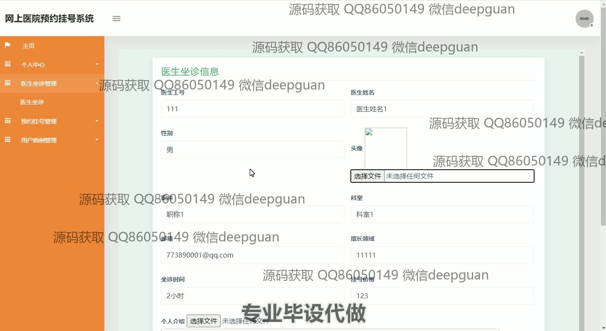

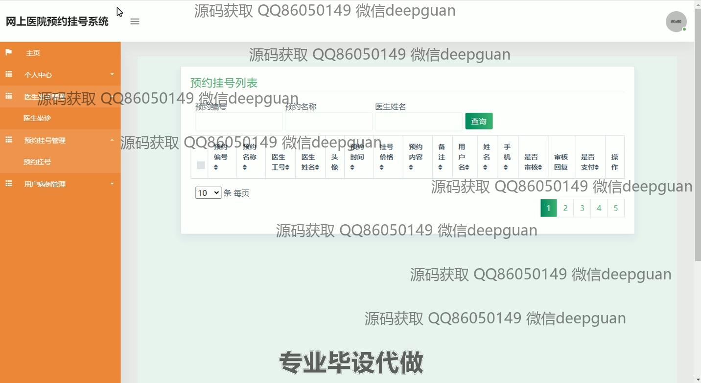
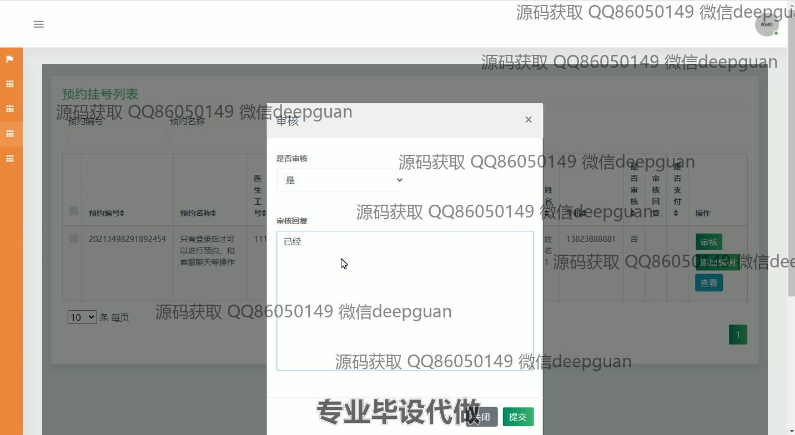

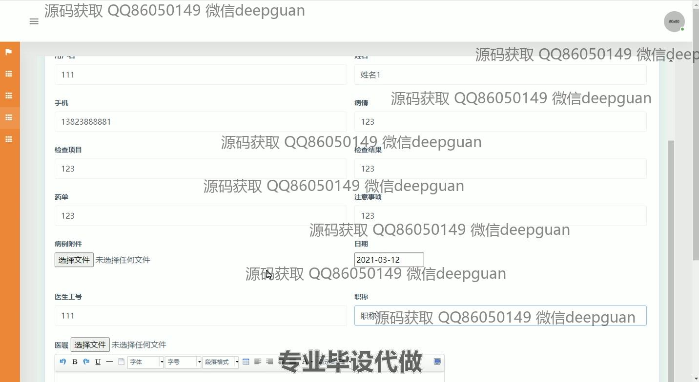
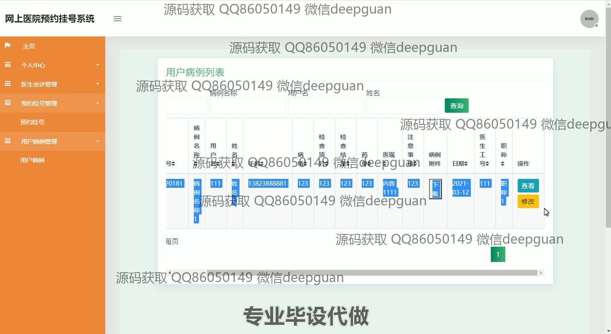
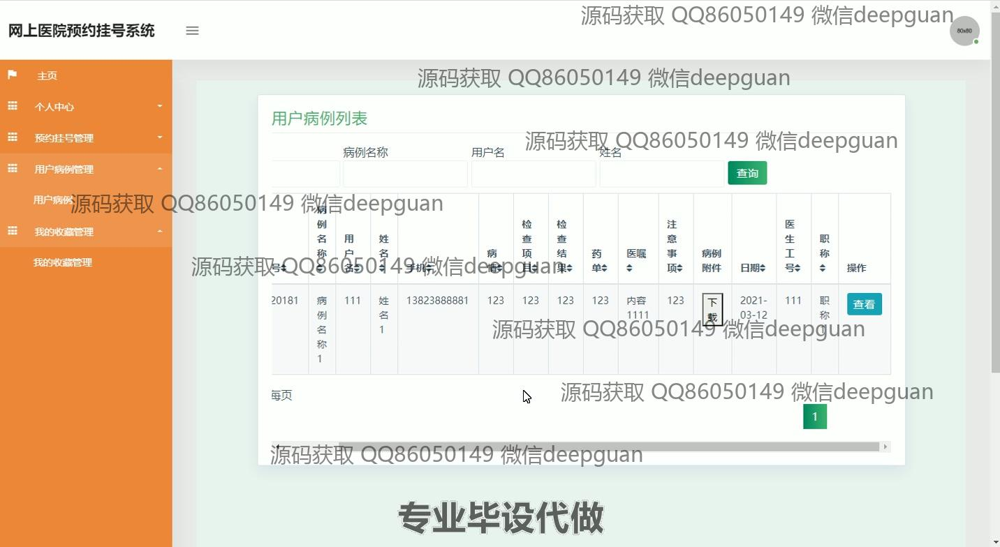

本代码来源于网络,仅供学习参考使用!

